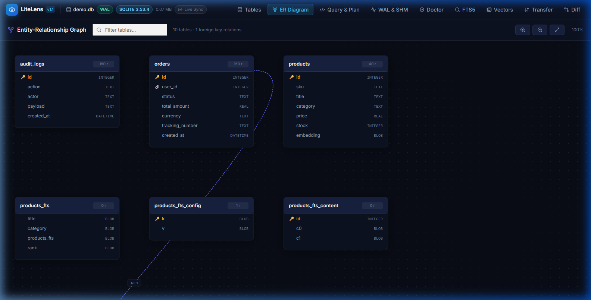
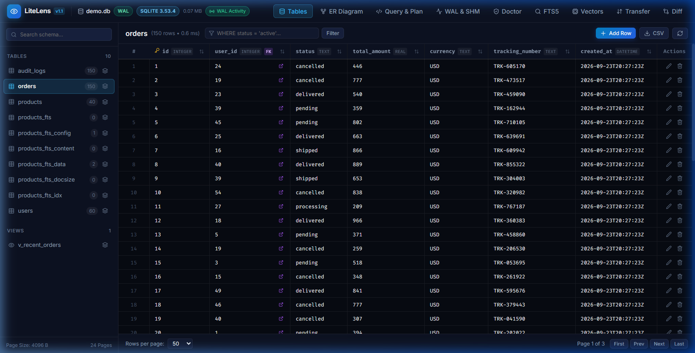
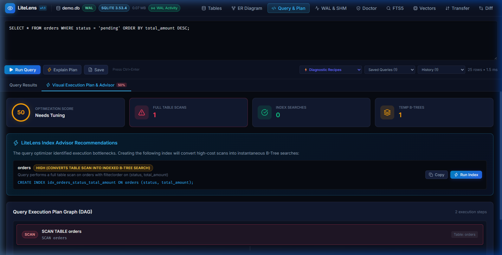
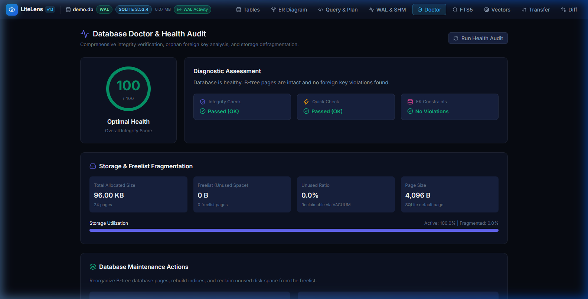
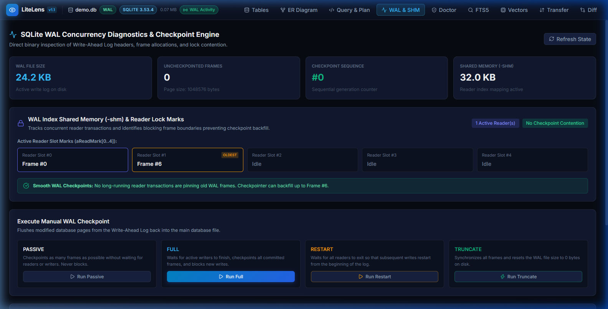
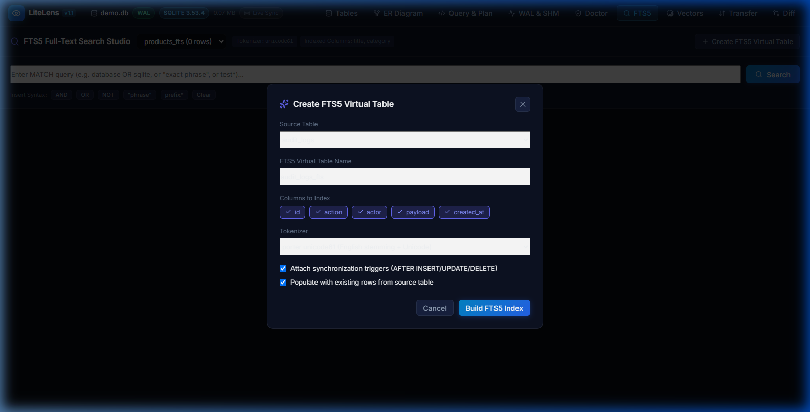
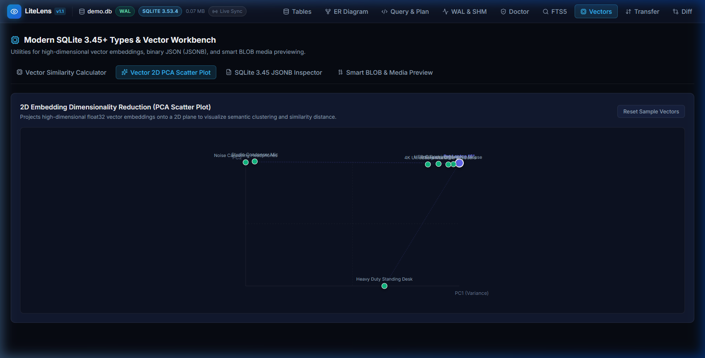
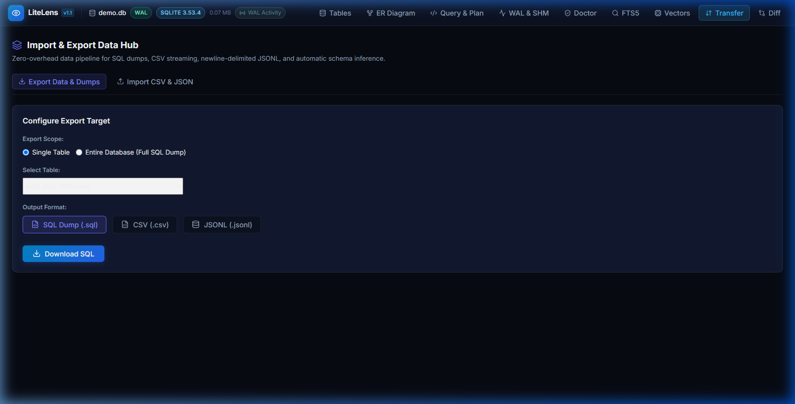
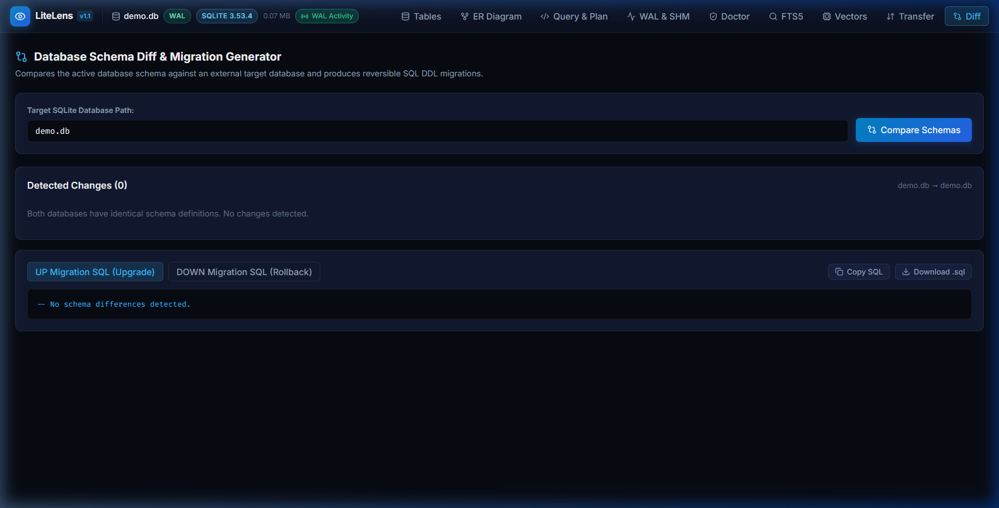

<p align="center">
  
</p>

<h1 align="center">LiteLens</h1>

<p align="center">
  <strong>SQLite 3.45+ Observability Studio, WAL Concurrency Engine and Diagnostics</strong>
</p>

<p align="center">
  <a href="https://golang.org"></a>
  <a href="https://react.dev"></a>
  <a href="LICENSE"></a>
  <a href="https://sqlite.org"></a>
  <a href="https://github.com/alexandrmotologa/litelens"></a>
</p>

<p align="center">
  
</p>

LiteLens is a single-binary management studio and diagnostic engine for modern SQLite 3.45+. It tackles critical database observability areas that traditional GUIs overlook: Write-Ahead Log concurrency diagnostics, visual query plan trees, missing index suggestions, vector embedding exploration, interactive ER diagrams, full-text search builders, and schema migrations.

LiteLens runs locally as a self-contained executable. It compiles with zero CGO dependencies via pure-Go SQLite (`modernc.org/sqlite`), embedding its React interface directly into the Go binary.

## Key Features

* **Database Doctor and Health Audit:** Comprehensive diagnostic health scores (0 to 100), PRAGMA integrity_check, quick_check, orphan foreign key detectors, freelist fragmentation metrics, and safe in-place VACUUM or VACUUM INTO execution.
* **Interactive ER Diagram:** Visual schema graph with cubic Bezier curves connecting foreign key relationships, 1:N cardinality indicators, pan and zoom canvas controls, and active table relation highlighting.
* **Visual Query Plan DAG:** Converts text EXPLAIN QUERY PLAN output into an interactive node graph with warning badges for full table scans and temporary B-tree sorting passes.
* **Index Advisor:** Evaluates query plan scans and generates targeted CREATE INDEX statements with estimated cost reductions.
* **WAL Index Shared Memory (-shm) Inspector:** Binary parser for the 136-byte WAL index header and the 5 concurrent reader lock marks (aReadMark[0..4]), actively identifying blocking reader frames holding back checkpoints.
* **FTS5 Full-Text Search Studio:** Visual query builder with match operators (AND, OR, NOT, prefix search, phrase matching), BM25 relevance ranking scores, keyword snippet highlighting, and a virtual table creation wizard with automatic synchronization triggers.
* **Vector 2D PCA Scatter Plot:** Dimensionality reduction projecting high-dimensional float32 vector embeddings onto an interactive 2D SVG canvas for cluster inspection, distance measurements, and similarity analysis.
* **Diagnostic Recipes and Saved Queries:** Pre-built 1-click SQLite diagnostic routines for discovering unindexed foreign keys, storage geometry footprints, trigger catalogs, and local query persistence.
* **Import and Export Hub:** Streaming SQL dumps with transaction-wrapped DDL and DML, RFC 4180 CSV exports, newline-delimited JSONL, and drag-and-drop CSV and JSON dataset importing with automatic schema inference.
* **Modern SQLite Types:** Decodes SQLite 3.45 binary JSON (jsonb), previews vector embeddings with distance metrics, and inspects image BLOBs directly.
* **Schema Diff and Migration Generator:** Compares two database files and outputs transactional SQL migration scripts.
* **Zero-CGO Distribution:** Compiles to a single binary with no external C dependencies or runtime shared libraries.

## Feature Tour

### Interactive ER Diagram and Relationship Graph
Inspect database relationships with cubic Bezier links, cardinality indicators, and table highlighting.


### Virtual Data Grid and In-Place Editing
Explore tables, views, and generated columns with pagination, search, sorting, and inline editing.


### Query Workbench and Visual EXPLAIN DAG
Write SQL queries, inspect tabular results, and visualize query execution trees with cost analysis.


### Database Doctor and Fragmentation Analyzer
Audit database integrity, detect orphaned foreign keys, analyze freelist pages, and optimize disk storage.


### WAL and Shared Memory Concurrency Engine
Monitor real-time WAL file growth, checkpoint progress, and the 5 reader locks in the `-shm` header.


### FTS5 Full-Text Search Studio
Construct BM25 search queries, test match syntax, and configure virtual full-text tables with sync triggers.


### Vector Space and 2D PCA Scatter Plot
Inspect float32 vector embeddings, visualize dimensional clusters via PCA, and calculate Euclidean distances.


### Data Transfer Hub
Export streaming SQL dumps, CSV, and JSONL formats or import raw datasets with automatic type inference.


### Schema Diff and Migration Engine
Compare two SQLite schemas side-by-side and generate safe, reversible SQL migration scripts.


## Architecture

LiteLens pairs a Go backend engine with a React 19 web interface embedded via `go:embed`.

```
Browser Interface (http://localhost:52000)
       │
       ▼ (HTTP REST / Server-Sent Events)
LiteLens Binary (Go)
  ├── Static Server: embedded React 19 UI
  ├── Engine Layer: pure-Go SQLite driver (modernc.org/sqlite)
  ├── Concurrency Monitor: WAL and SHM binary parsers, fsnotify watcher
  ├── Doctor and Diagnostics: PRAGMA integrity audit, freelist analyzer
  ├── FTS5 Engine: virtual table detector, DDL and trigger generator
  ├── Transfer Hub: streaming SQL dump, CSV/JSONL import and export
  ├── Query Analyzer: EXPLAIN parser and Index Advisor
  └── Schema Engine: AST comparator and migration generator
       │
       ▼ (Direct File I/O)
Target SQLite Database (.db, .sqlite, .wal, .shm)
```

## Quick Start

### Installation

Download the precompiled binary for your operating system from GitHub Releases, or install with Go:

```bash
go install github.com/alexandrmotologa/litelens@latest
```

### Basic Usage

Open a target SQLite database in your browser:

```bash
litelens app.db
```

Launch on a custom port without opening a browser window:

```bash
litelens -p 8080 --no-browser production.db
```

Open in read-only mode to prevent any writes:

```bash
litelens --read-only secure.db
```

Run query plan analysis directly in the terminal:

```bash
litelens explain app.db "SELECT * FROM orders WHERE status = 'pending' ORDER BY created_at"
```

Compare two database schemas and generate a migration script:

```bash
litelens diff v1.db v2.db --output migration.sql
```

## Development

### Prerequisites

* Go 1.23 or newer
* Node.js 20 or newer
* npm or pnpm

### Building from Source

1. Clone the repository:
   ```bash
   git clone https://github.com/alexandrmotologa/litelens.git
   cd litelens
   ```

2. Build the UI assets:
   ```bash
   cd ui
   npm install
   npm run build
   cd ..
   ```

3. Compile the Go binary:
   ```bash
   go build -o bin/litelens main.go
   ```

4. Run the development server with live reload:
   ```bash
   make dev
   ```

## License

MIT License. See [LICENSE](LICENSE) for details.
