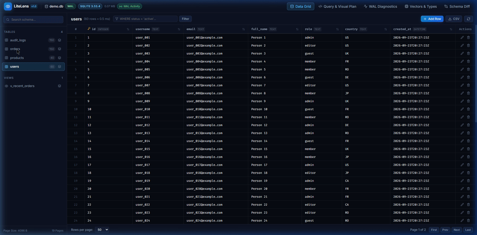

# LiteLens

LiteLens is a single-binary management studio and diagnostic engine for modern SQLite 3.45+. It focuses on areas that traditional database managers overlook: Write-Ahead Log concurrency diagnostics, visual query plan trees, missing index suggestions, vector embedding inspection, and schema diffing.

LiteLens runs locally as a standalone executable. It compiles with zero CGO dependencies via pure-Go SQLite (`modernc.org/sqlite`), embedding its React interface into the compiled Go binary.



## Highlights

* **WAL Concurrency Diagnostics:** Inspects active WAL frames, checkpoint delays, and lock contention patterns that cause `SQLITE_BUSY` errors.
* **Visual Query Plan:** Converts text `EXPLAIN QUERY PLAN` output into a structured graph with color-coded alerts for table scans and temporary sorting trees.
* **Index Advisor:** Evaluates query plan scans and suggests targeted `CREATE INDEX` statements.
* **Modern SQLite Types:** Decodes SQLite 3.45 binary JSON (`jsonb`), previews vector embeddings with distance metrics, and inspects image BLOBs directly.
* **Schema Diff and Migration Generator:** Compares two database files and outputs transactional SQL migration scripts.
* **Zero-CGO Distribution:** Compiles to a single binary with no external C dependencies.

## Architecture

LiteLens pairs a Go backend engine with a React 19 web interface embedded via `go:embed`.

```
Browser Interface (http://localhost:52000)
       │
       ▼ (HTTP REST / Server-Sent Events)
LiteLens Binary (Go)
  ├── Static Server: embedded React 19 UI
  ├── Engine Layer: pure-Go SQLite driver (modernc.org/sqlite)
  ├── Concurrency Monitor: WAL header reader and fsnotify watcher
  ├── Query Analyzer: EXPLAIN parser and Index Advisor
  └── Schema Engine: AST comparator and migration generator
       │
       ▼ (Direct File I/O)
Target SQLite Database (.db, .sqlite, .wal)
```

## Quick Start

### Installation

Download the precompiled binary for your operating system from GitHub Releases, or install with Go:

```bash
go install github.com/alexandrmotologa/litelens@latest
```

### Basic Usage

Open a target SQLite database in your browser:

```bash
litelens app.db
```

Launch on a custom port without opening a browser window:

```bash
litelens -p 8080 --no-browser production.db
```

Open in read-only mode to prevent any writes:

```bash
litelens --read-only secure.db
```

Run query plan analysis directly in the terminal:

```bash
litelens explain app.db "SELECT * FROM orders WHERE status = 'pending' ORDER BY created_at"
```

Compare two database schemas and generate a migration script:

```bash
litelens diff v1.db v2.db --output migration.sql
```

## Development

### Prerequisites

* Go 1.23 or newer
* Node.js 20 or newer
* npm or pnpm

### Building from Source

1. Clone the repository:
   ```bash
   git clone https://github.com/alexandrmotologa/litelens.git
   cd litelens
   ```

2. Build the UI assets:
   ```bash
   cd ui
   npm install
   npm run build
   cd ..
   ```

3. Compile the Go binary:
   ```bash
   go build -o bin/litelens main.go
   ```

4. Run the development server with live reload:
   ```bash
   make dev
   ```

## License

MIT License. See [LICENSE](LICENSE) for details.
